# 🔐 Voice Login with ECAPA-TDNN

A text-independent speaker verification system built with ECAPA-TDNN (Emphasized Channel Attention, Propagation and Aggregation in Time Delay Neural Network) from SpeechBrain. This application provides a complete voice-based authentication solution with enrollment, verification, and comprehensive performance analytics.


## 🎯 Overview

This system extracts unique voice characteristics (192-dimensional embeddings) from speech recordings to authenticate users. It's language-independent and doesn't require specific phrases, making it flexible and user-friendly.

**Key Capabilities:**
- Voice-based user enrollment with multi-sample support
- Real-time speaker verification and authentication
- SQLite database with full audit trail
- Interactive web interface powered by Gradio

## ✨ Features

### 🎤 Voice Authentication
- **Advanced Audio Preprocessing**:
  - **WebRTC VAD (Voice Activity Detection)**: Automatically removes leading/trailing silence before embedding extraction
  - **Amplitude Normalization**: Peak normalization to -3dBFS ensures consistent volume across all recordings
  - **Clipping Prevention**: Automatic signal limiting prevents distortion and overload
  - Intelligent speech-only segment extraction with configurable aggressiveness
  - Energy-based fallback trimming for robust silence removal
  - Automatic padding around speech segments to preserve natural speech boundaries
  - Real-time logging of all preprocessing operations
- **Advanced Enrollment Strategy**: 
  - 3 mandatory voice samples (5-10 seconds each) for robust profile creation
  - Strict quality enforcement with automatic rejection of short samples
  - Vietnamese text verification prompts for anti-spoofing
- **Sophisticated Scoring System**:
  - Weighted fusion: 60% top-2 average + 40% centroid similarity
  - Dynamic centroid computed on-the-fly from all stored samples
  - Detailed score breakdown showing individual sample contributions
- **Audio Quality Diagnostics**:
  - Real-time analysis of amplitude, SNR, clipping, and noise floor
  - Actionable feedback to improve recording quality
  - Context-aware suggestions for enrollment and login
- **Anti-Spoofing Protection**:
  - Text verification using Whisper ASR (Vietnamese support)
  - Word Error Rate (WER) validation (threshold: 0.50)
  - Early rejection of replay attacks and synthetic voices
- **Multi-Language Support**: Compatible with Vietnamese, English, and other languages
- **Adjustable Threshold**: Configurable similarity threshold (default: 0.80) for security vs. usability balance

### 🗄️ Data Management
- **SQLite Database**: Robust storage with ACID properties and transaction support
- **Complete Audit Trail**: Logs every authentication attempt with timestamp and score
- **User Management**: Easy interface to view, update, and delete enrolled users
- **Statistics Dashboard**: System-wide statistics and recent activity monitoring
- **Auto-Migration**: Seamless upgrade from legacy JSON format

### 🎨 User Interface
- **Gradio Web Interface**: Clean, intuitive interface accessible via browser
- **Enrollment Tab**: Step-by-step voice sample collection with guided prompts
- **Login Tab**: Quick authentication with real-time feedback
- **Management Tab**: User administration and system statistics

## 🚀 Quick Start

### Installation

```bash
# Clone the repository
git clone https://github.com/phatpham9/Voice-Login-ECAPA-TDNN.git
cd Voice-Login-ECAPA-TDNN

# Install dependencies with uv (recommended)
uv venv
uv pip install -r requirements.txt

# Or use pip
pip install -r requirements.txt
```

### Running the Application

**Production Mode:**
```bash
uv run app.py

# Or
python app.py
```

**Development Mode (auto-reload on code changes):**
```bash
uv run gradio app.py

# Or
gradio app.py
```

The Gradio interface will launch in your browser at `http://localhost:7860`

## 📋 Requirements

- **Python**: 3.8 or higher
- **PyTorch**: 2.0.0 - 2.4.x
- **TorchAudio**: 2.0.0 - 2.4.x
- **Core Libraries**: 
  - SpeechBrain 1.0.3 (ECAPA-TDNN speaker verification)
  - OpenAI Whisper (ASR for text verification)
  - WebRTC VAD 2.0.10 (Voice Activity Detection for silence removal)
  - jiwer 4.0.0 (Word Error Rate calculation)
  - Gradio 4.16.0 (Web interface)
  - NumPy, SoundFile (Audio processing)

See `requirements.txt` for complete dependencies.

## 📖 How to Use

### Enrollment

1. Open the **Enroll** tab
2. Enter a unique username
3. Record **3 mandatory voice samples** (5-10 seconds each):
   - Read the displayed Vietnamese text prompt for each sample
   - All 3 samples must pass text verification (WER < 0.50)
   - Each sample must be at least 5 seconds long
   - System automatically validates audio quality
4. Click **Enroll** to register the voice profile

**Requirements:**
- **Minimum length**: 5 seconds per sample (strictly enforced)
- **Text verification**: Must read displayed prompts accurately
- **All samples mandatory**: Cannot enroll with fewer than 3 samples
- **Quality standards**: Clear audio with minimal noise and clipping

**Tips:**
- Read the Vietnamese text prompts clearly and naturally
- Record in a quiet environment with good microphone
- Speak at normal volume (avoid shouting or whispering)
- Wait for text prompt to refresh between samples
- Each sample is stored separately for robust matching

### Authentication

1. Open the **Login** tab
2. Enter your username
3. Read the displayed Vietnamese text prompt (refreshable)
4. Record your voice (5+ seconds recommended)
5. Optionally adjust the similarity threshold (default: 0.80)
6. Click **Login** to verify

**Two-Stage Verification:**
1. **Text Verification** (Anti-Spoofing): 
   - Whisper ASR transcribes your speech
   - WER calculated against expected text
   - Rejects if WER > 0.50 (likely replay attack or wrong text)
2. **Speaker Verification** (if text passed):
   - Compares voice against all enrolled samples
   - Uses weighted scoring: 60% top-2 average + 40% centroid
   - Shows detailed score breakdown with best match indicator

**Result Information:**
- Individual similarity scores for each stored sample
- Weighted scoring strategy breakdown
- Text verification details (expected, detected, WER)
- Audio quality diagnostics and improvement suggestions

### Threshold Tuning

- **0.85-0.95**: High security, may reject some legitimate users
- **0.80** (default): Balanced security and convenience
- **0.65-0.75**: More permissive, lower security

## 🔧 Audio Preprocessing Pipeline

The system employs a sophisticated audio preprocessing pipeline to ensure high-quality embeddings:

```
Raw Audio Input
    ↓
1. Convert to 16kHz Mono
    ↓
2. Voice Activity Detection (VAD)
   • WebRTC VAD with aggressiveness=2
   • Removes leading/trailing silence
   • Preserves speech-only segments
   • Adds 300ms padding around speech
   • Fallback: Energy-based trimming
    ↓
3. Amplitude Normalization
   • Peak normalization to -3dBFS (~0.708)
   • Ensures consistent volume levels
   • Alternative: RMS normalization to -23dBFS
    ↓
4. Clipping Prevention
   • Hard clipping at ±0.99 threshold
   • Prevents signal overload
   • Alternative: Soft clipping (tanh-based)
    ↓
5. Length Normalization
   • Minimum: 5 seconds
   • Maximum: 15 seconds
   • Pad if too short, trim if too long
    ↓
6. ECAPA-TDNN Embedding Extraction
   • 192-dimensional speaker embedding
    ↓
Output: Clean, normalized embedding
```

**Benefits:**
- **Better Accuracy**: Removes silence and normalizes amplitude for cleaner embeddings
- **Consistency**: Standardized preprocessing across all audio samples regardless of recording volume
- **Robustness**: Handles various recording qualities, volumes, and environments
- **Prevents Distortion**: Clipping prevention ensures signals stay within valid range
- **Transparency**: Detailed logging of all preprocessing steps for monitoring

## 🏗️ Project Structure

```
Voice-Login-ECAPA-TDNN/
├── app.py                   # Main application entry point
├── Dockerfile               # Docker configuration for deployment
├── requirements.txt         # Python dependencies
├── enrollment_texts.json    # Vietnamese text prompts for anti-spoofing
├── src/                     # Source code modules
│   ├── __init__.py          # Package initialization
│   ├── core.py              # Core: model loading, VAD, audio preprocessing, embeddings
│   ├── database.py          # SQLite database operations and logging
│   ├── ui_login.py          # Login/authentication tab UI
│   ├── ui_enroll.py         # Enrollment tab UI
│   ├── ui_manage.py         # User management tab UI
│   └── ui_statistics.py     # Statistics dashboard tab UI
├── seed_db/                 # Database seeding utilities
│   ├── seed_db.py           # Script to populate test users
│   └── audio_samples/       # Sample audio files for seeding
├── audio_samples/           # User audio samples directory (runtime)
├── voice_auth.db            # SQLite database (auto-created at runtime)
├── ecapa/                   # ECAPA-TDNN model files (auto-downloaded)
├── whisper/                 # Whisper ASR model files (auto-downloaded)
├── LICENSE                  # MIT License
└── README.md                # This file
```

**Module Overview:**

**Core Application:**
- **app.py**: Application entry point, orchestrates UI tabs and launches Gradio interface
- **Dockerfile**: Container configuration for HuggingFace Spaces deployment

**Source Code (`src/`):**
- **core.py**: 
  - ECAPA-TDNN model loading and inference
  - **WebRTC VAD implementation** for silence removal
  - Audio preprocessing pipeline (mono conversion, resampling, normalization)
  - Embedding extraction and similarity computation
  - Whisper ASR integration for text verification
  - Audio quality diagnostics
- **database.py**: 
  - SQLite database initialization and schema management
  - User CRUD operations (create, read, update, delete)
  - Embedding storage and retrieval
  - Authentication attempt logging and audit trail
- **ui_login.py**: Login/authentication interface with text verification
- **ui_enroll.py**: Enrollment interface with multi-sample collection
- **ui_manage.py**: User management interface for viewing/deleting users
- **ui_statistics.py**: Statistics dashboard showing system metrics

**Configuration & Data:**
- **enrollment_texts.json**: Vietnamese text prompts for anti-spoofing during enrollment
- **voice_auth.db**: SQLite database storing user embeddings and authentication logs
- **test_vad.py**: Unit test script for validating VAD implementation

**Pre-trained Models (Auto-downloaded):**
- **ecapa/**: SpeechBrain ECAPA-TDNN model for speaker verification
- **whisper/**: OpenAI Whisper-tiny model for speech recognition

## ⚙️ Configuration

Key parameters in `src/core.py`:

```python
# Audio Preprocessing
VAD_AGGRESSIVENESS = 2             # WebRTC VAD aggressiveness (0-3)
VAD_FRAME_DURATION_MS = 30         # Frame size for VAD analysis
VAD_PADDING_MS = 300               # Padding around speech segments
AMPLITUDE_NORMALIZATION_TARGET = "peak"  # "peak" or "rms"
PEAK_NORMALIZATION_DB = -3.0       # Target peak level in dBFS
RMS_NORMALIZATION_DB = -23.0       # Target RMS level in dBFS (LUFS-like)
CLIPPING_THRESHOLD = 0.99          # Maximum amplitude before clipping
CLIPPING_METHOD = "clamp"          # "clamp" or "soft_clip"

# Enrollment Requirements
REQUIRED_ENROLLMENT_SAMPLES = 3    # Mandatory 3 samples
MIN_AUDIO_LENGTH_SEC = 5.0         # Minimum 5 seconds per sample

# Scoring Strategy (Weighted Fusion)
TOP_K_SAMPLES = 2                  # Use top 2 scores for averaging
SCORE_WEIGHT_TOP_K = 0.6          # 60% weight for top-k average
SCORE_WEIGHT_CENTROID = 0.4       # 40% weight for centroid similarity

# Anti-Spoofing
ENABLE_TEXT_VERIFICATION = True    # Enable/disable text verification
WER_THRESHOLD = 0.5                # Maximum Word Error Rate (50%)

# Authentication
DEFAULT_THRESHOLD = 0.80           # Default similarity threshold
```

## 🔬 Technical Details

### System Architecture Overview

```mermaid
flowchart TB
    Start([User Records Voice]) --> AudioInput[Audio Input]
    AudioInput --> Preprocessing[Audio Preprocessing<br/>- Mono conversion<br/>- 16kHz resampling]
    Preprocessing --> VAD[Voice Activity Detection<br/>- WebRTC VAD aggressiveness=2<br/>- Remove silence<br/>- 300ms padding]
    VAD --> AmpNorm[Amplitude Normalization<br/>- Peak: -3dBFS ~0.708<br/>- Consistent volume]
    AmpNorm --> Clipping[Clipping Prevention<br/>- Threshold: ±0.99<br/>- Prevent distortion]
    Clipping --> LengthNorm[Length Normalization<br/>- Min: 5s, Max: 15s<br/>- Pad/trim as needed]
    LengthNorm --> QualityCheck{Quality Check<br/>Passed?}
    QualityCheck -->|Fail| Reject1[❌ Reject:<br/>Quality issues]
    QualityCheck -->|Pass| TextVerify{Text Verification<br/>Enabled?}
    
    TextVerify -->|Yes| Whisper[Whisper ASR<br/>Transcribe Speech]
    Whisper --> WERCalc[Calculate WER vs<br/>Expected Text]
    WERCalc --> WERCheck{WER ≤ 0.50?}
    WERCheck -->|Fail| Reject2[❌ Reject:<br/>Anti-spoof failed]
    WERCheck -->|Pass| ECAPA[ECAPA-TDNN<br/>Extract 192D Embedding]
    
    TextVerify -->|No| ECAPA
    
    ECAPA --> Mode{Mode?}
    
    Mode -->|Enrollment| Store[Store Embedding<br/>to SQLite DB]
    Store --> Success1[✅ Enrollment<br/>Complete]
    
    Mode -->|Login| LoadDB[Load User's<br/>3 Stored Embeddings]
    LoadDB --> CompareAll[Compute Cosine Similarity<br/>with All Samples]
    CompareAll --> TopK[Top-2 Average<br/>60% weight]
    CompareAll --> Centroid[Centroid Similarity<br/>40% weight]
    TopK --> Fusion[Weighted Fusion<br/>Final Score]
    Centroid --> Fusion
    Fusion --> ThresholdCheck{Score ≥<br/>Threshold?}
    ThresholdCheck -->|Yes| Success2[✅ Authentication<br/>Success]
    ThresholdCheck -->|No| Reject3[❌ Authentication<br/>Failed]
    
    style Start fill:#e1f5ff,color:#000
    style Success1 fill:#d4edda,color:#000
    style Success2 fill:#d4edda,color:#000
    style Reject1 fill:#f8d7da,color:#000
    style Reject2 fill:#f8d7da,color:#000
    style Reject3 fill:#f8d7da,color:#000
    style Whisper fill:#fff3cd,color:#000
    style ECAPA fill:#fff3cd,color:#000
    style VAD fill:#d1ecf1,color:#000
    style AmpNorm fill:#d1ecf1,color:#000
    style Clipping fill:#d1ecf1,color:#000
    style LengthNorm fill:#d1ecf1,color:#000
```



### Model Architecture
- **Speaker Verification**: ECAPA-TDNN (SpeechBrain pre-trained)
  - Source: `speechbrain/spkrec-ecapa-voxceleb`
  - Embedding Size: 192 dimensions
  - Training Data: VoxCeleb (1M+ utterances, 7000+ speakers)
- **Speech Recognition**: Whisper-tiny (OpenAI)
  - Language: Vietnamese (`vi`)
  - Purpose: Anti-spoofing text verification
  - WER Threshold: 0.50

### Audio Processing Pipeline
1. Convert to mono (if stereo)
2. Resample to 16kHz
3. **Voice Activity Detection (VAD)**: Remove leading/trailing silence using WebRTC VAD
   - Aggressiveness: 2 (balanced for voice authentication)
   - Padding: 300ms around speech segments
   - Fallback: Energy-based silence trimming
4. **Amplitude Normalization**: Normalize volume to consistent level
   - Peak normalization to -3dBFS (~0.708 amplitude)
   - Ensures consistent recording volumes across samples
5. **Clipping Prevention**: Prevent signal overload
   - Hard clipping at ±0.99 threshold
   - Protects against distortion
6. Length normalization (5-15 seconds)
7. Quality analysis (amplitude, SNR, clipping, noise)
8. Text verification via Whisper ASR (if enabled)
9. Extract 192D embedding via ECAPA-TDNN
10. Compute weighted similarity score

### Enrollment Strategy
- **Mandatory samples**: Exactly 3 samples required
- **Minimum length**: 5 seconds per sample (strictly enforced)
- **Storage**: Each sample stored separately as 192D embedding (float32)
- **Text verification**: All samples must pass WER < 0.50 check
- **No averaging**: Preserves individual sample characteristics

### Scoring Strategy (Weighted Fusion)
- **Top-K Average** (60% weight): Average of top 2 similarity scores
  - Resilient to outliers and recording variations
  - Emphasizes best matches
- **Centroid Similarity** (40% weight): Compare against profile centroid
  - Centroid computed on-the-fly from all stored embeddings
  - Represents "average" voice characteristics
  - Not stored in database
- **Final Score**: `0.6 × top_k_avg + 0.4 × centroid_sim`
- **Similarity Metric**: Cosine similarity (range: -1 to 1, typically 0.5-1.0)

## 💡 Best Practices

**For Better Enrollment:**
- Read Vietnamese text prompts clearly and naturally
- Record 7-10 seconds per sample (exceeds 5s minimum)
- Maintain consistent recording conditions across all 3 samples
- Ensure quiet environment with good microphone
- Wait for quality diagnostics before proceeding
- If text verification fails, re-record and read prompt carefully

**For Better Login:**
- Read displayed text prompt accurately (check WER feedback)
- Speak naturally, similar to enrollment conditions
- Ensure minimum 5 seconds of speech
- Review diagnostic feedback if score is low
- Check text verification details if authentication fails

**Troubleshooting:**
- **Text verification fails**: Read prompt more carefully, check microphone clarity
- **Low similarity scores**: Check audio quality diagnostics, ensure 5+ seconds
- **High false acceptance**: Increase threshold (0.85-0.90)
- **High false rejection**: Lower threshold (0.70-0.75) or re-enroll with better samples
- **Replay attack detected**: Text verification working correctly (expected behavior)

## 🎓 Academic Context

Developed as part of the **Advanced Image Processing** course at Saigon University (SGU), demonstrating practical applications of deep learning in biometric authentication and audio signal processing.

## 🔐 Security Features

### Anti-Spoofing Protection
- **Text Verification**: Random Vietnamese prompts prevent replay attacks
- **Whisper ASR**: Transcribes speech and validates against expected text
- **WER Threshold**: 0.50 (50%+ accuracy required)
- **Early Rejection**: Text verification performed before speaker verification
- **Dynamic Prompts**: Refreshable texts prevent pre-recorded attacks

### Quality Assurance
- **Voice Activity Detection**: Automatic silence removal improves embedding quality
- **Minimum Length**: 5 seconds enforced (prevents truncated attacks)
- **Audio Quality Analysis**: Real-time SNR, clipping, and noise detection
- **Diagnostic Feedback**: Actionable suggestions for improvement
- **Strict Enrollment**: All 3 samples must pass quality and text checks

### Database Security
- **SQLite with ACID**: Atomic transactions and data integrity
- **Audit Trail**: Complete logging of all authentication attempts
- **Embedding Storage**: Raw embeddings stored (not audio data)

## 📚 References

- **ECAPA-TDNN Paper**: [Arxiv 2005.07143](https://arxiv.org/abs/2005.07143)
- **SpeechBrain**: [Documentation](https://speechbrain.readthedocs.io/)
- **ECAPA Model**: [HuggingFace Model Card](https://huggingface.co/speechbrain/spkrec-ecapa-voxceleb)
- **Whisper ASR**: [OpenAI Whisper](https://github.com/openai/whisper)
- **WebRTC VAD**: [Python WebRTC VAD](https://github.com/wiseman/py-webrtcvad)
- **VoxCeleb Dataset**: [Official Website](https://www.robots.ox.ac.uk/~vgg/data/voxceleb/)

## 📝 License

MIT License - see [LICENSE](LICENSE) file for details.

---

**Note**: This is an educational project demonstrating advanced voice authentication techniques. For production deployment, consider additional security measures including liveness detection, encrypted storage, multi-factor authentication, and regular security audits.
